.. _concepts:

********************
Concepts and Classes
********************

.. note::
   This tutorial was generated from the python source :file:`ptypy/tutorial/ptypyclasses.py` using :file:`ptypy/doc/script2rst.py`.

.. _ptypyclasses:

Tutorial: Data access abstraction - Storage, View, Container
============================================================

First a hort reminder from the classes Module about the classes
this tutorial covers

.. parsed-literal::

   This module defines flexible containers for the various quantities needed
   for ptychographic reconstructions.
   
   **Container class**
       A high-level container that keeps track of sub-containers (Storage)
       and Views onto them. A container can copy itself to produce a buffer
       needed for calculations. Mathematical operations are not implemented at
       this level. Operations on arrays should be done using the Views, which
       simply return numpyarrays.
   
   
   **Storage class**
       The sub-container, wrapping a numpy array buffer. A Storage defines a
       system of coordinate (for now only a scaled translation of the pixel
       coordinates, but more complicated affine transformation could be
       implemented if needed). The sub-class DynamicStorage can adapt the size
       of its buffer (cropping and/or padding) depending on the Views.
   
   
   **View class**
       A low-weight class that contains all information to access a 2D piece
       of a Storage within a Container.
   
Import some modules

::

   >>> import matplotlib as mpl
   >>> import numpy as np
   >>> import ptypy
   >>> from ptypy import utils as u
   >>> from ptypy.core import View,Container,Storage,Base
   >>> plt = mpl.pyplot

A single Storage in one Container
---------------------------------

As master class we create a :any:`Container` instance

::

   >>> C1=Container(data_type='real')

This class itself holds nothing at first. In order to store data in 
``C1`` we have to add a :any:`Storage` to that container.

::

   >>> S1=C1.new_storage(shape=(1,7,7))

Since we haven't specified an ID the Container class picks one for ``S1``
In this case that will be ``S0000`` where the *S* refers to the class type.

::

   >>> print S1.ID
   S0000
   

We can have a look now what kind of data Storage holds. 

::

   >>> print S1.formatted_report()[0]
   (C)ontnr : Memory : Shape            : Pixel size      : Dimensions      : Views
   (S)torgs : (MB)   : (Pixel)          : (meters)        : (meters)        : act. 
   --------------------------------------------------------------------------------
   S0000    :    0.0 :            1*7*7 :   1.00*1.00e+00 :   7.00*7.00e+00 :     0
   

Apart from the ID on the left we discover a few other entries, for
example the quantity ``psize`` which refers to the physical pixelsize 
for the last two dimensions of the stored data.

::

   >>> print S1.psize
   [ 1.  1.]
   

Many attributes of a :any:`Storage` are in fact *properties*. Changing
their value may have an impact on other methods or attributes of the
class. For example. One convenient method is Storage.\ :py:meth:`~ptypy.core.classes.Storage.grids`
that creates grids for the last two dimensions (see also
:py:func:`ptypy.utils.array_utils.grids`)

::

   >>> y,x = S1.grids()
   >>> print y
   [[[-3. -3. -3. -3. -3. -3. -3.]
     [-2. -2. -2. -2. -2. -2. -2.]
     [-1. -1. -1. -1. -1. -1. -1.]
     [ 0.  0.  0.  0.  0.  0.  0.]
     [ 1.  1.  1.  1.  1.  1.  1.]
     [ 2.  2.  2.  2.  2.  2.  2.]
     [ 3.  3.  3.  3.  3.  3.  3.]]]
   
   >>> print x
   [[[-3. -2. -1.  0.  1.  2.  3.]
     [-3. -2. -1.  0.  1.  2.  3.]
     [-3. -2. -1.  0.  1.  2.  3.]
     [-3. -2. -1.  0.  1.  2.  3.]
     [-3. -2. -1.  0.  1.  2.  3.]
     [-3. -2. -1.  0.  1.  2.  3.]
     [-3. -2. -1.  0.  1.  2.  3.]]]
   

These are cooridinate grids for vertical and horizontal axes respectively
We also see that these coordinates have their center at::

::

   >>> print S1.center
   [3 3]
   

So now we change a few properties. For example,

::

   >>> S1.center = (2,2)
   >>> S1.psize = 0.1
   >>> g = S1.grids()
   >>> print g[0]
   [[[-0.2 -0.2 -0.2 -0.2 -0.2 -0.2 -0.2]
     [-0.1 -0.1 -0.1 -0.1 -0.1 -0.1 -0.1]
     [ 0.   0.   0.   0.   0.   0.   0. ]
     [ 0.1  0.1  0.1  0.1  0.1  0.1  0.1]
     [ 0.2  0.2  0.2  0.2  0.2  0.2  0.2]
     [ 0.3  0.3  0.3  0.3  0.3  0.3  0.3]
     [ 0.4  0.4  0.4  0.4  0.4  0.4  0.4]]]
   
   >>> print g[1]
   [[[-0.2 -0.1  0.   0.1  0.2  0.3  0.4]
     [-0.2 -0.1  0.   0.1  0.2  0.3  0.4]
     [-0.2 -0.1  0.   0.1  0.2  0.3  0.4]
     [-0.2 -0.1  0.   0.1  0.2  0.3  0.4]
     [-0.2 -0.1  0.   0.1  0.2  0.3  0.4]
     [-0.2 -0.1  0.   0.1  0.2  0.3  0.4]
     [-0.2 -0.1  0.   0.1  0.2  0.3  0.4]]]
   

We see that the center has moved one pixel up and one down. If we want 
to use a physical quantity for the center, we may also set the top left
pixel to a new value, which shifts the center to a new position.

::

   >>> S1.origin -= 0.12
   >>> y,x = S1.grids()
   >>> print y
   [[[-0.32 -0.32 -0.32 -0.32 -0.32 -0.32 -0.32]
     [-0.22 -0.22 -0.22 -0.22 -0.22 -0.22 -0.22]
     [-0.12 -0.12 -0.12 -0.12 -0.12 -0.12 -0.12]
     [-0.02 -0.02 -0.02 -0.02 -0.02 -0.02 -0.02]
     [ 0.08  0.08  0.08  0.08  0.08  0.08  0.08]
     [ 0.18  0.18  0.18  0.18  0.18  0.18  0.18]
     [ 0.28  0.28  0.28  0.28  0.28  0.28  0.28]]]
   
   >>> print x
   [[[-0.32 -0.22 -0.12 -0.02  0.08  0.18  0.28]
     [-0.32 -0.22 -0.12 -0.02  0.08  0.18  0.28]
     [-0.32 -0.22 -0.12 -0.02  0.08  0.18  0.28]
     [-0.32 -0.22 -0.12 -0.02  0.08  0.18  0.28]
     [-0.32 -0.22 -0.12 -0.02  0.08  0.18  0.28]
     [-0.32 -0.22 -0.12 -0.02  0.08  0.18  0.28]
     [-0.32 -0.22 -0.12 -0.02  0.08  0.18  0.28]]]
   
   >>> print S1.center
   [ 3.2  3.2]
   

Up until now our actual *data* numpy array located at ``S1.data`` is 
still filled with the not so exciting ones. We can use 
:any:`Storage.fill` to fill that container

::

   >>> S1.fill(x+y)
   >>> print S1.data
   [[[-0.64 -0.54 -0.44 -0.34 -0.24 -0.14 -0.04]
     [-0.54 -0.44 -0.34 -0.24 -0.14 -0.04  0.06]
     [-0.44 -0.34 -0.24 -0.14 -0.04  0.06  0.16]
     [-0.34 -0.24 -0.14 -0.04  0.06  0.16  0.26]
     [-0.24 -0.14 -0.04  0.06  0.16  0.26  0.36]
     [-0.14 -0.04  0.06  0.16  0.26  0.36  0.46]
     [-0.04  0.06  0.16  0.26  0.36  0.46  0.56]]]
   

We can also plot the data using 
:py:func:`~ptypy.utils.plot_utils.plot_storage` 

::

   >>> fig = u.plot_storage(S1,0)

See :numref:`ptypyclasses_00` for the plotted image.

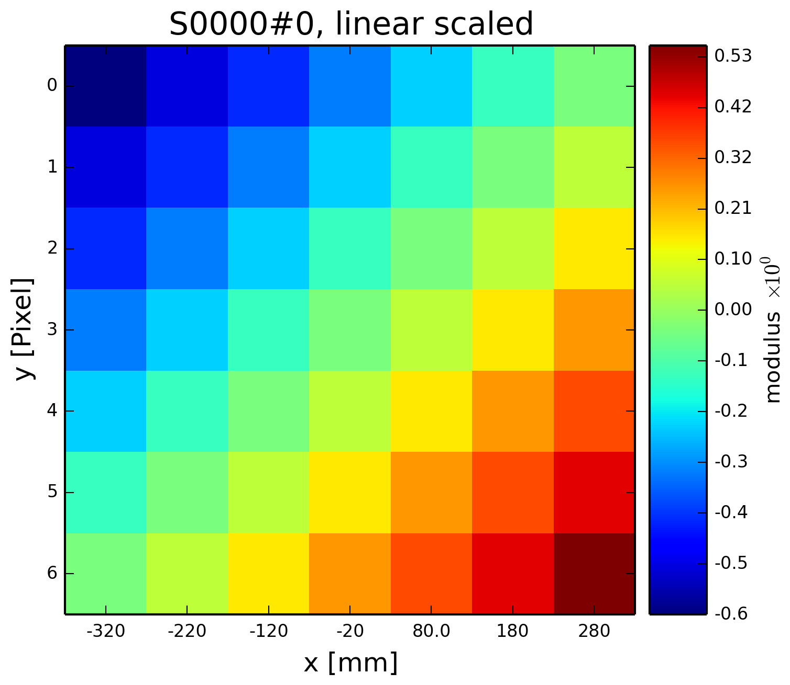

   This is a test of a figure plot

Adding Views as a way to access data
------------------------------------

Besides being able to access the data directly through its attribute
and the corresponding *numpy* syntax, ptypy offers acces through a
:any:`View` instance. The View invocation is a bit more complex.

::

   >>> from ptypy.core.classes import DEFAULT_ACCESSRULE
   >>> ar = DEFAULT_ACCESSRULE.copy()
   >>> print ar
   * id3VLGGMQ788           : ptypy.utils.parameters.Param(6)
     * layer                : 0
     * psize                : 1.0
     * shape                : None
     * coord                : None
     * active               : True
     * storageID            : None
   
   

Now let's say we want a 4x4 view on Storage ``S1`` around the origin.
We set

::

   >>> ar.shape = (4,4)  # ar.shape = 4 would have been also valid
   >>> ar.coord = 0.      # ar.coord = (0.,0.)
   >>> ar.storageID = S1.ID
   >>> ar.psize = None

Now we can construct the View. The last step in this process is an 
update of the View by the Storage ``S1`` which transfers data
data ranges/coordinates to the View.

::

   >>> V1 = View(C1, ID=None, accessrule = ar)

We see that a number of the accessrule items appear in the View now.

::

   >>> print V1.shape
   [4 4]
   
   >>> print V1.coord
   [ 0.  0.]
   
   >>> print V1.storageID
   S0000
   

A few other were set by the automatic update of Storage

::

   >>> print V1.psize
   [ 0.1  0.1]
   
   >>> print V1.storage
             S0000 :    0.00 MB :: data=(1, 7, 7) @float64 psize=[ 0.1  0.1] center=[ 3.2  3.2]
   

The update also set new attributes of the View that start with 
a lower 'd' and are locally stored information about data access. 

::

   >>> print V1.dlayer, V1.dlow, V1.dhigh
   0 [1 1] [5 5]
   

Finally, we can retrieve the data subset by applying the View to the storage.

::

   >>> data = S1[V1]
   >>> print data
   [[-0.44 -0.34 -0.24 -0.14]
    [-0.34 -0.24 -0.14 -0.04]
    [-0.24 -0.14 -0.04  0.06]
    [-0.14 -0.04  0.06  0.16]]
   

It does not matter if we apply the View to Storage ``S1`` or the 
container ``C1``, or use the View internal 
View.\ :py:meth:`~ptypy.core.classes.View.data` property.

::

   >>> print np.allclose(data,C1[V1])
   True
   
   >>> print np.allclose(data,V1.data)
   True
   

The first access yielded a similar result because the 
:py:attr:`~ptypy.core.classes.View.storageID` is in ``C1`` and the
second acces method worked because it uses the View's 
:py:attr:`~ptypy.core.classes.View.storage` attribute

::

   >>> print V1.storage is S1
   True
   
   >>> print V1.storageID in C1.S.keys()
   True
   

We observe that the coordinate [0.0,0.0] is not part of the grid
in S1 anymore. Consequently, the View was put as close to [0.0,0.0]
as possible. The coordinate in data space, that the View would have as
center is the attribute :py:meth:`~ptypy.core.classes.View.pcoord` while
:py:meth:`~ptypy.core.classes.View.dcoord` is the closest data coordinate
The difference is held by :py:meth:`~ptypy.core.classes.View.sp` such 
that a subpixel correction may be applied if needed (future release)

::

   >>> print V1.dcoord, V1.pcoord, V1.sp
   [3 3] [ 3.2  3.2] [ 0.2  0.2]
   

.. note::
   Please note that we cannot guarantee any API stability for other 
   attributes / properties besides *.data*, *.shape* and *.coord*

If we set the coordinate to some other value in the grid, we can eliminate
the subpixel misfit. By changing the *.coord* property, we need to
update the View manually, as the View-Storage interaction is non-automatic
apart from the View construction - a measure of caution.

::

   >>> V1.coord = (0.08,0.08)
   >>> S1.update_views(V1)
   >>> print V1.dcoord, V1.pcoord, V1.sp
   [4 4] [ 4.  4.] [ 0.  0.]
   

Oh we see that the high range limit of the View is close to the border 
of the data buffer... so what happens if we push the coordinate further?

::

   >>> print V1.dhigh
   [6 6]
   
   >>> V1.coord = (0.28,0.28)
   >>> S1.update_views(V1)
   >>> print V1.dhigh
   [8 8]
   

Now the higher range limit of the View is certianly off bounds.
Applying this View to the Storage can lead to undesired behavior, i.e.
concatenation or data access errors.

::

   >>> print S1[V1]
   [[ 0.16  0.26  0.36]
    [ 0.26  0.36  0.46]
    [ 0.36  0.46  0.56]]
   
   >>> print S1[V1].shape , V1.shape
   (3, 3) [4 4]
   

One important feature of the :any:`Storage` class is that it can detect
all out-of-bounds accesses and reformat the data buffer accordingly.
A simple call to 
*Storage*.\ :py:meth:`~ptypy.core.classes.Storage.reformat` should do. 

::

   >>> print S1.shape
   (1, 7, 7)
   
   >>> mn = S1[V1].mean()
   >>> S1.fill_value = mn
   >>> S1.reformat()
   >>> print S1.shape
   (1, 4, 4)
   

Oh no, the Storage data buffer has shrunk! .. Don't worry. That is
intended behavior. A call to *.reformat()* crops and pads the data 
buffer around all **active** Views. 
You need to set

::

   >>> S1.padonly = True
if you want to avoid that the data buffer is cropped. We leave this
as an exercise to the user. Instead we add a new View at different 
location to verify that the buffer will try to reach both Views.

::

   >>> ar2 = ar.copy()
   >>> ar2.coord = (-0.82,-0.82)
   >>> V2 = View(C1, ID=None, accessrule = ar2)
   >>> S1.fill_value = 0.
   >>> S1.reformat()
   >>> print S1.shape
   (1, 15, 15)
   

Ok we see that the the buffer has grown in size. Now we give the new
View a copied values of the other view for a nice figure

::

   >>> V2.data = V1.data.copy()
   >>> fig = u.plot_storage(S1,2)

See :numref:`ptypyclasses_02` for the plotted image.

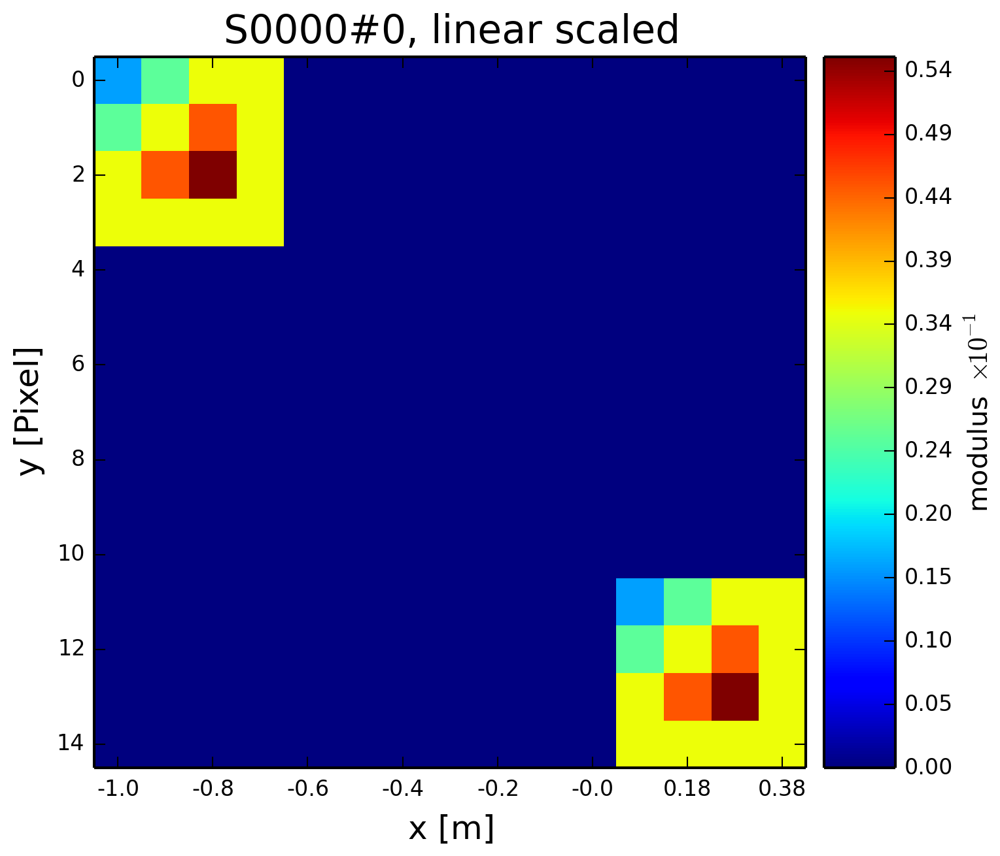

   Storage with 4x4 views of the same content.

We observe that the data buffer spans both views.
Now let us add more....

::

   >>> for i in range(1,11):
   >>>     ar2 = ar.copy()
   >>>     ar2.coord = (-0.82+i*0.1,-0.82+i*0.1)
   >>>     View(C1, ID=None, accessrule = ar2)

A handy method of the :any:`Storage` class is that it can determine
its own coverage by views.

::

   >>> S1.data[:] = S1.get_view_coverage()
   >>> fig = u.plot_storage(S1,3)

See :numref:`ptypyclasses_03` for the plotted image.

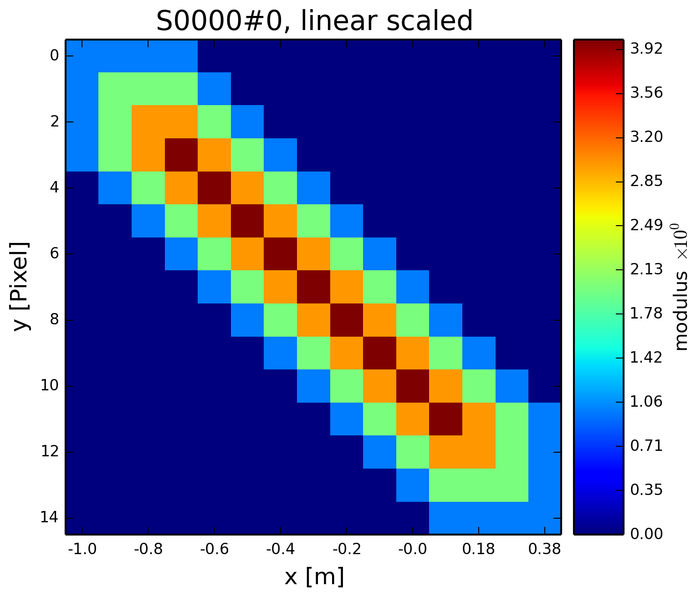

   View coverage in data buffer of ``S1``.

Another handy feature of the :any:`View` class is that it automatically
create a Storage instance to the ``storageID`` if it does not already
exist.

::

   >>> ar = DEFAULT_ACCESSRULE.copy()
   >>> ar.shape = 200
   >>> ar.coord = 0.
   >>> ar.storageID = 'S100'
   >>> ar.psize = 1.0
   >>> V3=View(C1,ID=None,accessrule = ar)

Finally we have a look at the mischief we managed so far.

::

   >>> print C1.formatted_report()
   (C)ontnr : Memory : Shape            : Pixel size      : Dimensions      : Views
   (S)torgs : (MB)   : (Pixel)          : (meters)        : (meters)        : act. 
   --------------------------------------------------------------------------------
   None     :    0.3 : float64
   S100     :    0.3 :        1*200*200 :   1.00*1.00e+00 :   2.00*2.00e+02 :     1
   S0000    :    0.0 :          1*15*15 :   1.00*1.00e-01 :   1.50*1.50e+00 :    12
   
   

.. note::
   This tutorial was generated from the python source :file:`ptypy/tutorial/simupod.py` using :file:`ptypy/doc/script2rst.py`.

.. _simupod:

Tutorial: Mimicking the setup - Pod, Geometry
=============================================

In the :ref:`ptypyclasses` we have learned to deal with the
basic data storage-and-access class on small toy arrays.

In this tutorial we will learn how to create :any:`POD` instances to 
simulate a ptychography experiment and use larger arrays.

We would like to point out that the "data" created her is not actual
data. There is neither light or other wave-like particle involved 
nor actual diffraction. You will also not find
an actual movement of motors or stages, nor is there an actual detector
Everything should be understood as a test for this software.

The selected physical quantities only mimic a physical experiement.

We start of with importing some modules

::

   >>> import matplotlib as mpl
   >>> import numpy as np
   >>> import ptypy
   >>> from ptypy import utils as u
   >>> from ptypy.core import View,Container,Storage,Base, POD
   >>> plt = mpl.pyplot
   >>> import sys
   >>> scriptname = sys.argv[0].split('.')[0]

We create a managing top level instance. We will not use the
the :any:`Ptycho` class for now, as its rich set of methods may be
a bit overwhelming to start. Instead we take a plain Base instance

::

   >>> P = Base()
   >>> P.CType = np.complex128
   >>> P.FType = np.float64

Set "experimental" geometry and create propagator
-------------------------------------------------

In this tutorial we accept help from the :any:`Geo` class to provide
a propagator and pixel sizes for sample and detector space.

::

   >>> from ptypy.core import geometry
   >>> g = u.Param()
   >>> g.energy = None #u.keV2m(1.0)/6.32e-7
   >>> g.lam = 5.32e-7
   >>> g.distance = 15e-2
   >>> g.psize = 24e-6
   >>> g.shape = 256
   >>> g.propagation = "farfield"
   >>> G = geometry.Geo(owner = P, pars=g)

The Geo instance ``G`` has done a lot already at this moment. First
of all we find forward and backward propagator at ``G.propagator.fw``
and ``G.propagator.bw``. It has also calculated the appropriate sample
space pixel size (aka resolution),

::

   >>> print G.resolution
   [  1.29882812e-05   1.29882812e-05]
   
which sets the shifting frame to be of the following size:

::

   >>> fsize = G.shape * G.resolution
   >>> print "%.2fx%.2fmm" % tuple(fsize*1e3)
   3.32x3.32mm
   

Create probing illumination
---------------------------

Next we need to create a probing illumination. 
We start of we a suited container that we call *probe*

::

   >>> P.probe = Container(P,'Cprobe',data_type='complex')

For convenience, there is a test probing illumination in ptypy's 
resources.

::

   >>> from ptypy.resources import moon_pr
   >>> pr = -moon_pr(G.shape)
   >>> pr = P.probe.new_storage(data=pr, psize=G.resolution)
   >>> fig = u.plot_storage(pr,0)

See :numref:`simupod_00` for the plotted image.

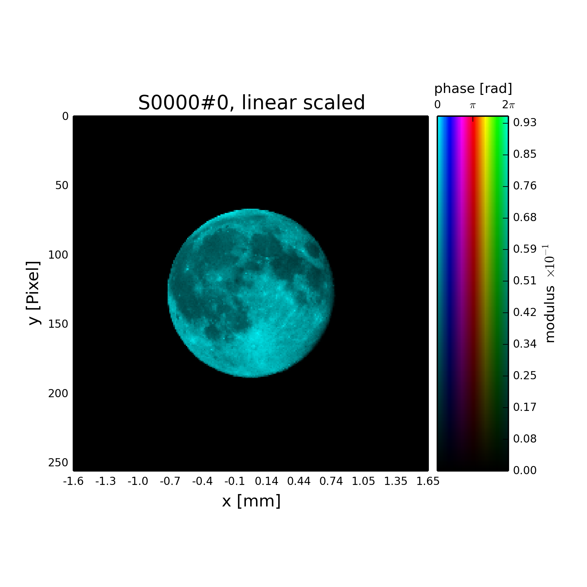

   Ptypy's default testing illumination, an image of the moon.

Of course we could have also used the coordinate grids from the propagator,

::

   >>> y,x = G.propagator.grids_sam
   >>> apert = u.smooth_step(fsize[0]/5-np.sqrt(x**2+y**2),3e-5)
   >>> pr2 = P.probe.new_storage(data=apert, psize=G.resolution)
   >>> fig = u.plot_storage(pr2,1)

See :numref:`simupod_01` for the plotted image.

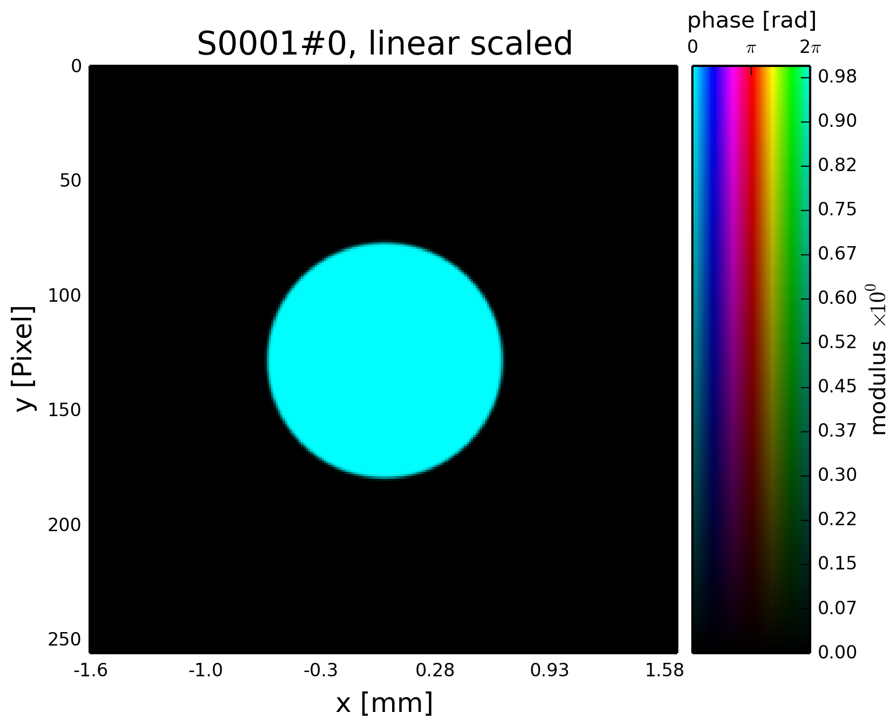

   Round test illumination.

or the coordinate grids from the Storage itself.

::

   >>> pr3 = P.probe.new_storage(shape=G.shape, psize=G.resolution)
   >>> y,x = pr3.grids()
   >>> apert = u.smooth_step(fsize[0]/5-np.abs(x),3e-5)*u.smooth_step(fsize[1]/5-np.abs(y),3e-5)
   >>> pr3.fill(apert)
   >>> fig = u.plot_storage(pr3,2)

See :numref:`simupod_02` for the plotted image.

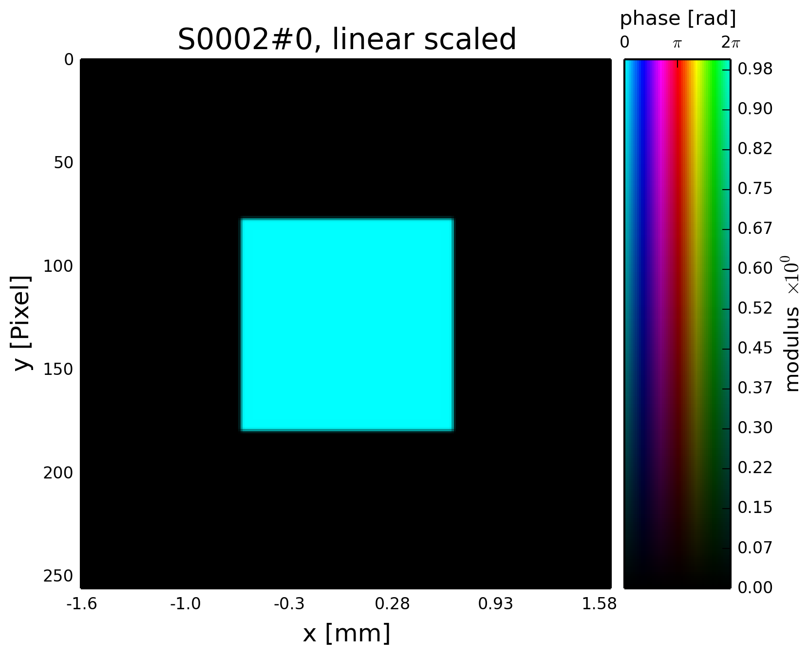

   Square test illumination.

In order to put some physics in the illumination we set the number of
photons to 1 billion

::

   >>> for pp in [pr,pr2,pr3]:
   >>>     pp.data *= np.sqrt(1e8/np.sum(pp.data*pp.data.conj()))

We quickly test if the propagation works.

::

   >>> ill = pr.data[0]
   >>> propagated_ill = G.propagator.fw(ill)
   >>> fig=plt.figure(3);ax = fig.add_subplot(111);
   >>> im = ax.imshow(np.log10(np.abs(propagated_ill)+1))
   >>> plt.colorbar(im)

See :numref:`simupod_03` for the plotted image.

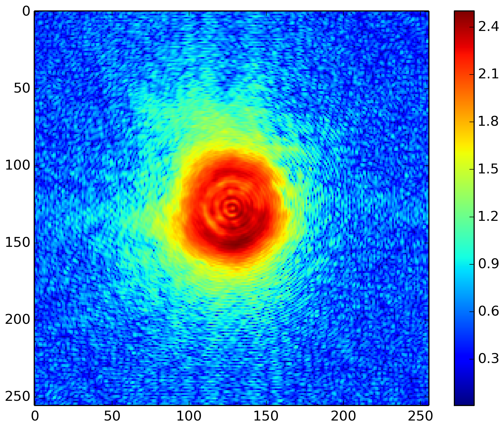

   Logarhitmic intensity of propagated illumination

Create scan pattern and object
------------------------------

We use the :py:mod:`ptypy.core.xy` module to create a scan pattern.

::

   >>> pos = u.Param()
   >>> pos.model = "round"
   >>> pos.spacing = fsize[0]/8
   >>> pos.steps = None
   >>> pos.extent = fsize*1.5
   >>> from ptypy.core import xy
   >>> positions = xy.from_pars(pos)
   >>> fig=plt.figure(4);ax = fig.add_subplot(111);
   >>> ax.plot(positions[:,1],positions[:,0],'o-');

See :numref:`simupod_04` for the plotted image.

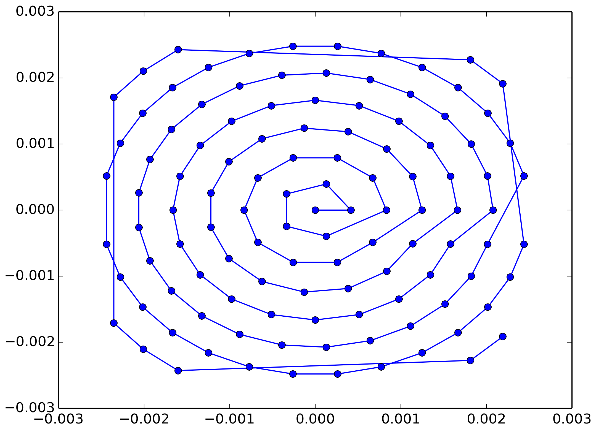

   Created scan pattern.

Next we need to create an object transmisson/ 
We start of with a suited container that we call *obj*

::

   >>> P.obj = Container(P,'Cobj',data_type='complex')

As we have learned from the previous :ref:`ptypyclasses`\ ,
we can use :any:`View`\ 's to create a Storage data buffer of the
right size.

::

   >>> oar = View.DEFAULT_ACCESSRULE.copy()
   >>> oar.storageID='S00'
   >>> oar.psize = G.resolution
   >>> oar.layer = 0
   >>> oar.shape = G.shape
   >>> oar.active = True

::

   >>> for pos in positions:
   >>>     # the rule
   >>>     r = oar.copy()
   >>>     r.coord = pos
   >>>     V = View(P.obj,None,r)

Now we need to let the Storages in ``P.obj`` reformat to 
include all Views. Conveniently, this can initiated from the top
with Container.\ :py:meth:`~ptypy.core.classes.Container.reformat`

::

   >>> P.obj.reformat()
   >>> print P.obj.formatted_report()
   (C)ontnr : Memory : Shape            : Pixel size      : Dimensions      : Views
   (S)torgs : (MB)   : (Pixel)          : (meters)        : (meters)        : act. 
   --------------------------------------------------------------------------------
   Cobj     :    6.5 : complex128
   S00      :    6.5 :        1*638*632 :   1.30*1.30e-05 :   8.29*8.21e-03 :   114
   
   

We need to fill the object storag ``S00`` with an object transmission.
Again there is a convenience transmission function in the resources

::

   >>> from ptypy.resources import flower_obj
   >>> storage = P.obj.storages['S00']
   >>> storage.fill(flower_obj(storage.shape[-2:]))
   >>> fig = u.plot_storage(storage,5)

See :numref:`simupod_05` for the plotted image.

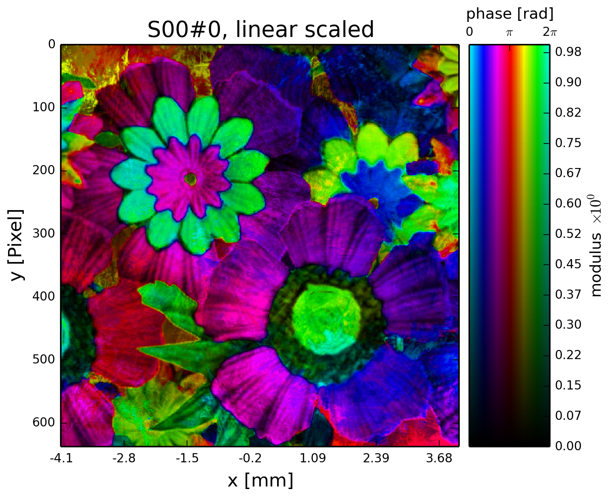

Creating additional Views and the PODs
--------------------------------------

A single coherent propagation in ptypy is represented by the pod class

::

   >>> print POD.__doc__
   
       POD : Ptychographic Object Descriptor
       
       A POD brings together probe view, object view and diff view. It also
       gives access to "exit", a (coherent) exit wave, and to propagation
       objects to go from exit to diff space. 
       
   
   >>> print POD.__init__.__doc__
   
           Parameters
           ----------
           ptycho : Ptycho
               The instance of Ptycho associated with this pod. 
               
           ID : str or int
               The pod ID, If None it is managed by the ptycho.
               
           views : dict or Param
               The views. See :py:attr:`DEFAULT_VIEWS`.
               
           geometry : Geo
               Geometry class instance and attached propagator
   
           
   

For creating a single POD we need a View to *probe*, *object*,
*exit* wave and *diff*\ raction containers as well as the :any:`Geo` 
class instance. 

First we create the missing contianers

::

   >>> P.exit =  Container(P,'Cexit',data_type='complex')
   >>> P.diff =  Container(P,'Cdiff',data_type='real')
   >>> P.mask =  Container(P,'Cmask',data_type='real')

We start with the first POD and its views

::

   >>> objviews = P.obj.views.values()
   >>> obview = objviews[0]

We construct the probe View

::

   >>> probe_ar = View.DEFAULT_ACCESSRULE.copy()
   >>> probe_ar.psize = G.resolution
   >>> probe_ar.shape = G.shape
   >>> probe_ar.active = True
   >>> probe_ar.storageID = pr.ID
   >>> prview = View(P.probe,None,probe_ar)

We construct exit wave View. This construction is shorter as we only 
change a few bits in the acces rule.

::

   >>> exit_ar = probe_ar.copy()
   >>> exit_ar.layer = 0
   >>> exit_ar.active = True
   >>> exview = View(P.exit,None,exit_ar)

We construct diffraction and mask view. Even shorter as the mask is 
essentially the same access as for the diffraction data.

::

   >>> diff_ar = probe_ar.copy()
   >>> diff_ar.layer = 0
   >>> diff_ar.active = True
   >>> diff_ar.psize = G.psize
   >>> mask_ar = diff_ar.copy()
   >>> maview = View(P.mask,None,mask_ar)
   >>> diview = View(P.diff,None,diff_ar)

Now we can create the POD

::

   >>> pods = []
   >>> views = {'probe':prview,'obj':obview,'exit':exview,'diff':diview,'mask':maview}
   >>> pod = POD(P,ID=None,views=views,geometry=G)
   >>> pods.append(pod)

The :any:`POD` is the most important class in ptycho. Its instances 
are used to write the reconstruction algorithms using local references 
from their attributes. For example we can create and store and exit
wave in this convenient fashion:

::

   >>> pod.exit = pod.probe * pod.object

The result of the calculation is stored in the respective storage.
Therefore we can use this command to plot the result.

::

   >>> exit_storage = P.exit.storages.values()[0]
   >>> fig = u.plot_storage(exit_storage,6)

See :numref:`simupod_06` for the plotted image.

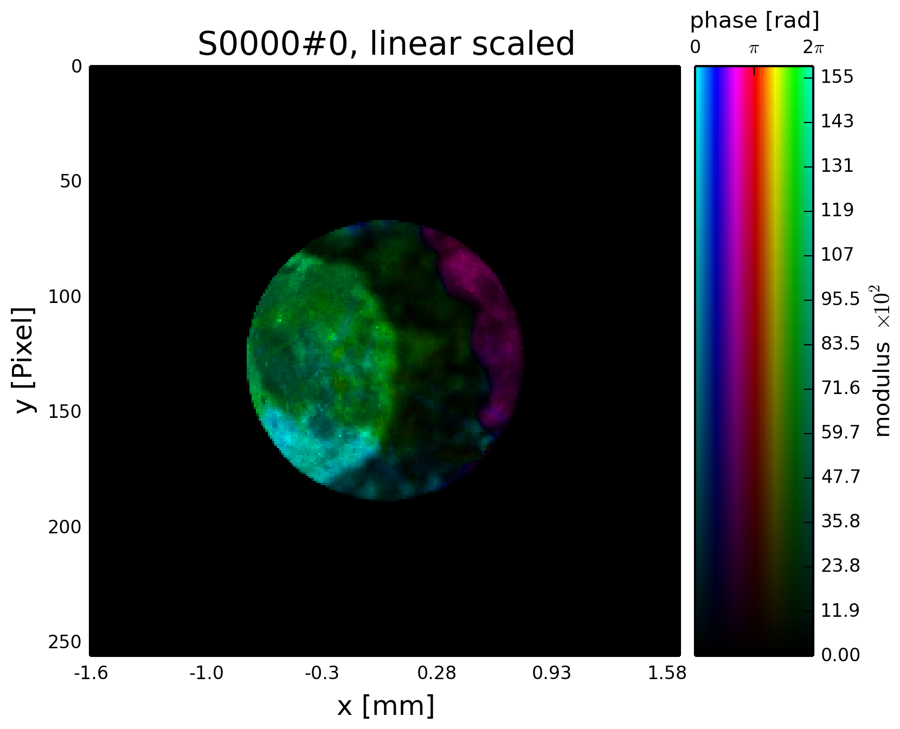

   Simulated exit wave using a pod

The diffraction plane is also conveniently accessible

::

   >>> pod.diff = np.abs(pod.fw(pod.exit))**2

The result is stored in the diffraction container.

::

   >>> diff_storage = P.diff.storages.values()[0]
   >>> fig = u.plot_storage(diff_storage,7,modulus='log')

See :numref:`simupod_07` for the plotted image.

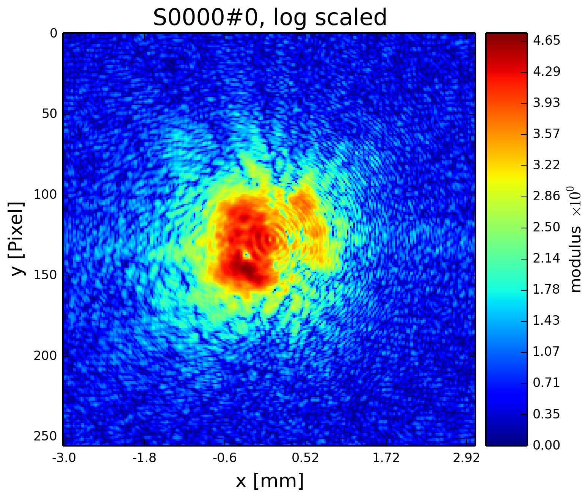

Creating the rest of the pods is simple since the data accesses are similar.

::

   >>> for obview in objviews[1:]:
   >>>     # we keep the same probe access
   >>>     prview = View(P.probe,None,probe_ar)
   >>>     # For diffraction diffraction and exit wave we need to increase the
   >>>     # layer index as exit wave and diffraction pattern is unique per
   >>>     # scan position
   >>>     exit_ar.layer +=1
   >>>     diff_ar.layer +=1
   >>>     exview = View(P.exit,None,exit_ar)
   >>>     maview = View(P.mask,None,mask_ar)
   >>>     diview = View(P.diff,None,diff_ar)
   >>>     views = {'probe':prview,'obj':obview,'exit':exview,'diff':diview,'mask':maview}
   >>>     pod = POD(P,ID=None,views=views,geometry=G)
   >>>     pods.append(pod)
   >>>     

::

   >>> for pod in pods:
   >>>     pod.exit = pod.probe * pod.object
   >>>     # we use Poisson statistics for a tiny bit of realism in the
   >>>     # diffraction images
   >>>     pod.diff = np.random.poisson(np.abs(pod.fw(pod.exit))**2)
   >>>     pod.mask = np.ones_like(pod.diff)

A quick check on the diffraction patterns

::

   >>> fig = u.plot_storage(diff_storage,8,slices=(slice(2),slice(None),slice(None)),modulus='log')

See :numref:`simupod_08` for the plotted image.

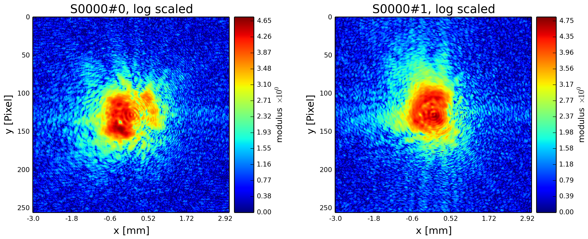

   Diffraction patterns with poisson statistics.

**Well done!**
We can now move forward to create and run a reconstruction engine
as in section :ref:`basic_algorithm` in :ref:`ownengine`
or store the generated diffraction patterns as in the next section.

.. _store:

Storing the simulation
----------------------

On unix system we choose the /tmp folder

::

   >>> save_path = '/tmp/ptypy/sim/'
   >>> import os

::

   >>> if not os.path.exists(save_path):
   >>>     os.makedirs(save_path)

First we save the geometric info in a text file.

::

   >>> with open(save_path+'geometry.txt','w') as f:
   >>>     f.write('distance %.4e\n' % G.p.distance)
   >>>     f.write('energy %.4e\n' % G.energy)
   >>>     f.write('psize %.4e\n' % G.psize[0])
   >>>     f.write('shape %d\n' % G.shape[0])
   >>>     f.close()

Now we save positions and the diffraction images. We don't burden
ouselves for now by selecting an image file format such as .tiff or 
.hdf5 but use numpys binary storage format

::

   >>> with open(save_path+'positions.txt','w') as f:
   >>>     if not os.path.exists(save_path+'ccd/'):
   >>>         os.mkdir(save_path+'ccd/')
   >>>     for pod in pods:
   >>>         diff_frame = 'ccd/diffraction_%04d.npy' % pod.di_view.layer
   >>>         f.write(diff_frame+' %.4e %.4e\n' % tuple(pod.ob_view.coord))
   >>>         frame = pod.diff.astype(np.int32)
   >>>         np.save(save_path+diff_frame, frame)

If you want to learn how to convert this "experiment" into ptypy data
file (``.ptyd``), see to :ref:`subclassptyscan`

.. note::
   This tutorial was generated from the python source :file:`ptypy/tutorial/ownengine.py` using :file:`ptypy/doc/script2rst.py`.

.. _ownengine:

Tutorial: A reconstruction engine from scratch
==============================================

In this tutorial we want to to provide the ptypy user with the information
needed to create an engine compatible with the state mixture
expansion of ptychogrpahy as desribed in Thibault et. al 2012 [Thi2012]_ .

First we import ptypy and the utility module

::

   >>> import ptypy
   >>> from ptypy import utils as u
   >>> import numpy as np

Preparing a managing Ptycho instance
------------------------------------

We need to prepare a managing :any:`Ptycho`\ . It requires a parameter
tree, as specified by ..

First, we create a most basic input paramater tree. While there 
are many default values, we manually specify a more verbose output
and single precision.

::

   >>> p = u.Param()
   >>> p.verbose_level = 3
   >>> p.data_type = "single"

Now we need to create a set of scans that we wish to reconstruct 
in a single run. We will use a single scan that we call 'MF' and
marking the data source as 'test' to use the Ptypy internal 
:any:`MoonFlowerScan`

::

   >>> p.scans = u.Param()
   >>> p.scans.MF = u.Param()
   >>> p.scans.MF.data= u.Param()
   >>> p.scans.MF.data.source = 'test'
   >>> p.scans.MF.data.shape = 128
   >>> p.scans.MF.data.num_frames = 400

This bare parameter tree will be the input for the :any:`Ptycho`
class which is constructed at level 2, which means that it creates
all necessary basic :any:`Container` instances like *probe*, *object* 
*diff* , etc. It also loads the first chunk of data and creates all 
:any:`View` and :any:`POD` instances, as the verbose output will tell.

::

   >>> P = ptypy.core.Ptycho(p,level=2)
   Verbosity set to 3
   Data type:               single
   
   ---- Ptycho init level 1 -------------------------------------------------------
   Model: sharing probe between scans (one new probe every 1 scan)
   Model: sharing probe between scans (one new probe every 1 scan)
   
   ---- Ptycho init level 2 -------------------------------------------------------
   Prepared 106 positions
   Processing new data.
   ---- Enter PtyScan.initialixe() ------------------------------------------------
                Common weight : True
                       shape = (128, 128)
   All experimental positions : True
                       shape = (106, 2)
   Scanning positions (106) are fewer than the desired number of scan points (400).
   Resetting `num_frames` to lower value
   ---- Leaving PtyScan.initialixe() ----------------------------------------------
   ROI center is [ 64.  64.], automatic guess is [ 63.45283019  63.54716981].
   Feeding data chunk
   Importing data from MF as scan MF.
   End of scan reached
   End of scan reached
   
   --- Scan MF photon report ---
   Total photons   : 4.16e+09 
   Average photons : 3.93e+07
   Maximum photons : 7.13e+07
   -----------------------------
   
   ---- Creating PODS -------------------------------------------------------------
   Found these probes : 
   Found these objects: 
   Process 0 created 106 new PODs, 1 new probes and 1 new objects.
   
   ---- Probe initialization ------------------------------------------------------
   Initializing probe storage S00G00 using scan MF
   Found no photon count for probe in parameters.
   Using photon count 7.13e+07 from photon report
   
   ---- Object initialization -----------------------------------------------------
   Initializing object storage S00G00 using scan MF
   Simulation resource is object transmission
   
   ---- Creating exit waves -------------------------------------------------------
   
   Process #0 ---- Total Pods 106 (106 active) ----
   --------------------------------------------------------------------------------
   (C)ontnr : Memory : Shape            : Pixel size      : Dimensions      : Views
   (S)torgs : (MB)   : (Pixel)          : (meters)        : (meters)        : act. 
   --------------------------------------------------------------------------------
   Cprobe   :    0.1 : complex64
   S00G00   :    0.1 :        1*128*128 :   6.36*6.36e-08 :   8.14*8.14e-06 :   106
   Cmask    :    1.7 :   bool
   S0000    :    1.7 :      106*128*128 :   1.72*1.72e-04 :   2.20*2.20e-02 :   106
   Cexit    :   13.9 : complex64
   S0000G00 :   13.9 :      106*128*128 :   6.36*6.36e-08 :   8.14*8.14e-06 :   106
   Cobj     :    1.5 : complex64
   S00G00   :    1.5 :        1*434*436 :   6.36*6.36e-08 :   2.76*2.77e-05 :   106
   Cdiff    :    6.9 : float32
   S0000    :    6.9 :      106*128*128 :   1.72*1.72e-04 :   2.20*2.20e-02 :   106
   
   
   

A quick look at the diffraction data

::

   >>> diff_storage = P.diff.storages.values()[0]
   >>> fig = u.plot_storage(diff_storage,0,slices=(slice(2),slice(None),slice(None)),modulus='log')

See :numref:`ownengine_00` for the plotted image.

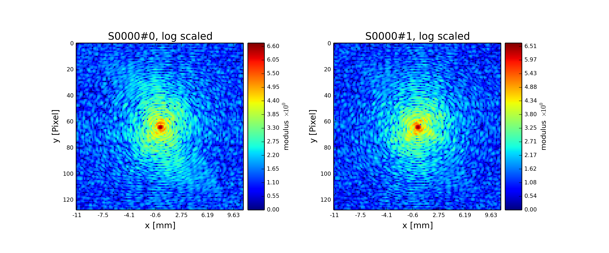

   Plot of simulated diffraction data for the first two positions.

Probe and object are not so exciting to look at for now. As default,
probes are initialized with an aperture like support.

::

   >>> probe_storage = P.probe.storages.values()[0]
   >>> fig = u.plot_storage(P.probe.S['S00G00'],1)

See :numref:`ownengine_01` for the plotted image.

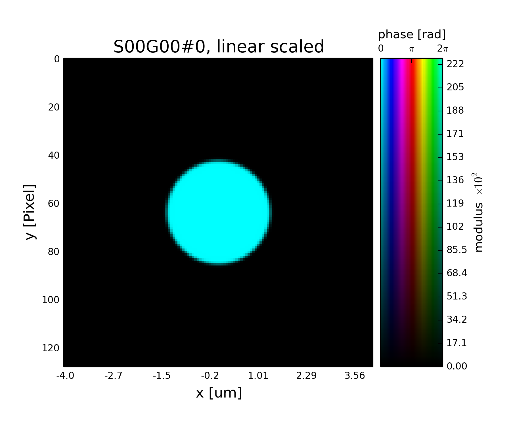

   Plot of the starting guess for the probe.

.. _basic_algorithm:

A basic Difference-Map implementation
-------------------------------------

Now we can start implementing a simple DM algorithm. We need three basic
functions, one is the ``fourier_update`` that implements the Fourier
modulus constraint.

.. math::
   \psi_{d,\lambda,k} = \mathcal{D}_{\lambda,z}^{-1}\left\{\sqrt{I_{d}}\frac{\mathcal{D}_{\lambda,z} \{\psi_{d,\lambda,k}\}}{\sum_{\lambda,k} |\mathcal{D}_{\lambda,z} \{\psi_{d,\lambda,k}\} |^2}\right\}

::

   >>> def fourier_update(pods):
   >>>     import numpy as np
   >>>     pod = pods.values()[0]
   >>>     # Get Magnitude and Mask
   >>>     mask = pod.mask
   >>>     modulus = np.sqrt(np.abs(pod.diff))
   >>>     # Create temporary buffers
   >>>     Imodel= np.zeros_like(pod.diff) 
   >>>     err = 0.                             
   >>>     Dphi = {}                                
   >>>     # Propagate the exit waves
   >>>     for gamma, pod in pods.iteritems():
   >>>         Dphi[gamma]= pod.fw( 2*pod.probe*pod.object - pod.exit )
   >>>         Imodel += Dphi[gamma] * Dphi[gamma].conj()
   >>>     # Calculate common correction factor
   >>>     factor = (1-mask) + mask* modulus /(np.sqrt(Imodel) + 1e-10)
   >>>     # Apply correction and propagate back
   >>>     for gamma, pod in pods.iteritems():
   >>>         df = pod.bw(factor*Dphi[gamma])-pod.probe*pod.object
   >>>         pod.exit += df
   >>>         err += np.mean(np.abs(df*df.conj()))
   >>>     # Return difference map error on exit waves
   >>>     return err

::

   >>> def probe_update(probe,norm,pods,fill=0.):
   >>>     """
   >>>     Updates `probe`. A portion `fill` of the probe is kept from 
   >>>     iteration to iteration. Requires `norm` buffer and pod dictionary
   >>>     """
   >>>     probe *= fill
   >>>     norm << fill + 1e-10
   >>>     for name,pod in pods.iteritems():
   >>>         if not pod.active: continue
   >>>         probe[pod.pr_view] += pod.object.conj() * pod.exit
   >>>         norm[pod.pr_view] += pod.object * pod.object.conj()
   >>>     # For parallel usage (MPI) we have to communicate the buffer arrays
   >>>     probe.allreduce()
   >>>     norm.allreduce()
   >>>     probe /= norm

::

   >>> def object_update(obj,norm,pods,fill=0.):
   >>>     """
   >>>     Updates `object`. A portion `fill` of the object is kept from 
   >>>     iteration to iteration. Requires `norm` buffer and pod dictionary
   >>>     """
   >>>     obj *= fill
   >>>     norm << fill + 1e-10
   >>>     for pod in pods.itervalues():
   >>>         if not pod.active: continue
   >>>         pod.object += pod.probe.conj() * pod.exit
   >>>         norm[pod.ob_view] += pod.probe * pod.probe.conj()
   >>>     obj.allreduce()
   >>>     norm.allreduce()
   >>>     obj /= norm

::

   >>> def iterate(Ptycho, num):
   >>>     # generate container copies
   >>>     obj_norm = P.obj.copy(fill=0.)
   >>>     probe_norm = P.probe.copy(fill=0.)
   >>>     errors = []
   >>>     for i in range(num):
   >>>         err = 0
   >>>         # fourier update
   >>>         for di_view in Ptycho.diff.V.itervalues():
   >>>             if not di_view.active: continue
   >>>             err += fourier_update(di_view.pods)
   >>>         # probe update
   >>>         probe_update(Ptycho.probe, probe_norm, Ptycho.pods)
   >>>         # object update
   >>>         object_update(Ptycho.obj, obj_norm, Ptycho.pods)
   >>>         # print error
   >>>         errors.append(err)
   >>>         if i % 3==0: print err
   >>>     # cleanup
   >>>     P.obj.delete_copy()
   >>>     P.probe.delete_copy()
   >>>     #return error
   >>>     return errors

We start of with a small number of iterations.

::

   >>> iterate(P,9)
   121460.248581
   108074.186073
   90265.5596637
   

We note that the error (here only displayed for 3 iterations) is 
already declining. That is a good sign. 
Let us have a look how the probe has developed.

::

   >>> fig = u.plot_storage(P.probe.S['S00G00'],2)

See :numref:`ownengine_02` for the plotted image.

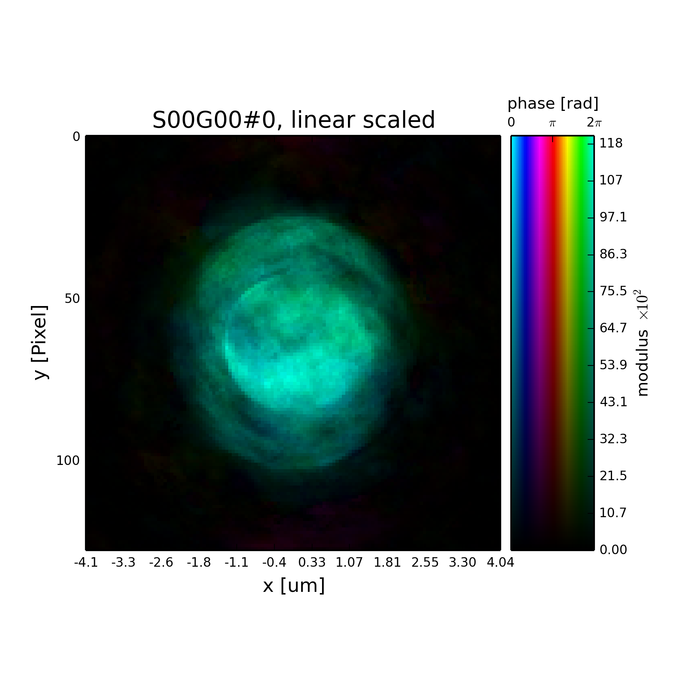

   Plot of the reconstructed probe after 9 iterations. We observe that
   the actaul illumination of the sample must be larger than the initial
   guess.

Looks like the probe is on a good way. How about the object?

::

   >>> fig = u.plot_storage(P.obj.S['S00G00'],3,slices=(slice(1),slice(120,-120),slice(120,-120)))

See :numref:`ownengine_03` for the plotted image.

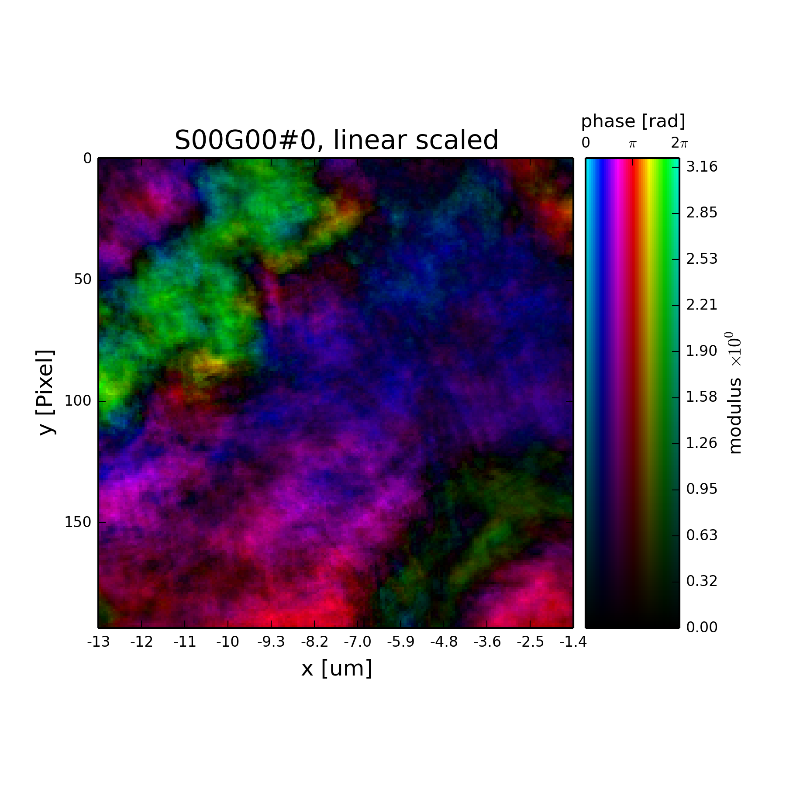

   Plot of the reconstructed obejct after 9 iterations. It is not quite
   clear what object is reconstructed

Ok, let us do some more iterations. 36 will do.

::

   >>> iterate(P,36)
   73505.6988351
   60426.2629207
   46878.8783637
   35414.8450051
   27620.1189331
   21449.69478
   15720.8855359
   11323.0182742
   8029.03131812
   6328.31167126
   5554.83945017
   5617.04460605
   

Error is still on a steady descent. Let us look at the final 
reconstructed probe and object.

::

   >>> fig = u.plot_storage(P.probe.S['S00G00'],4)

See :numref:`ownengine_04` for the plotted image.

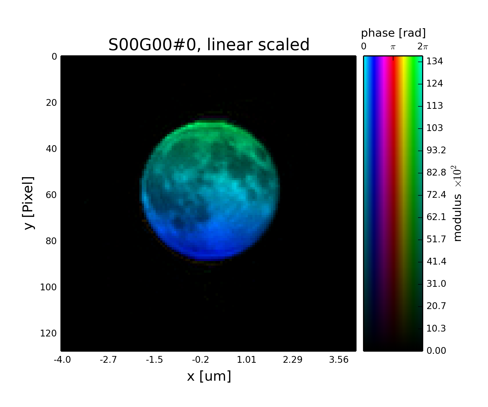

   Plot of the reconstructed probe after a total of 45 iterations.
   It's a moon !

   >>> fig = u.plot_storage(P.obj.S['S00G00'],5,slices=(slice(1),slice(120,-120),slice(120,-120)))

See :numref:`ownengine_05` for the plotted image.

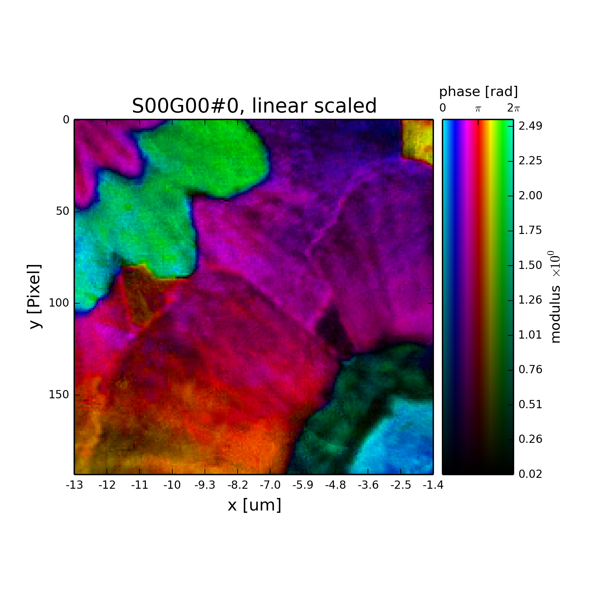

   Plot of the reconstructed object after a total of 45 iterations.
   It's a bunch of flowers !

.. [Thi2012] P. Thibault and A. Menzel, **Nature** 494, 68 (2013)

