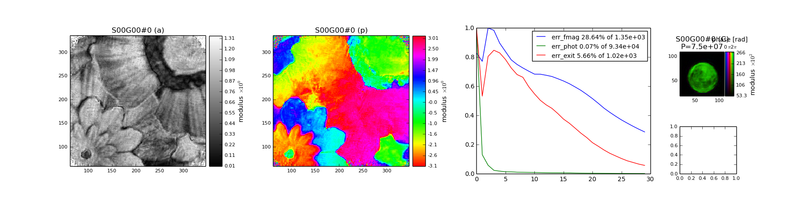

.. _getting_started:

**************************
Getting started with Ptypy
**************************

.. _installation:

Installation
============

General installation instructions
---------------------------------

Being a python package, |ptypy|_ depends on a number of other
packages which are listed below.
Once its dependecies are met, ptypy should work *out-of-the-box*.

.. note:: 
   |ptypy| is developed for Python 2.7.x and is currently incompatible
   with Python 3.x. Python 3 support is planned in future releases.
          

Essential packages
^^^^^^^^^^^^^^^^^^

* `NumPy <https://pypi.python.org/pypi/numpy/1.9.2>`_ 
  (homepage: `<http://www.numpy.org>`_)
* `SciPy <https://pypi.python.org/pypi/scipy/0.15.1>`_ 
  (homepage: `<http://www.scipy.org>`_)
* `h5py <https://pypi.python.org/pypi/scipy/2.5.0>`_ 
  (homepage: `<http://www.h5py.org>`_)

Recommended packages for additional functionality
^^^^^^^^^^^^^^^^^^^^^^^^^^^^^^^^^^^^^^^^^^^^^^^^^
Please note that |ptypy| is an alpha release and lacks rigorous import 
checking. There may be parts of code that implicitly ask for any of the
packages listed here. Therefore, we recommend to install these packages.

* `Matplotlib <https://pypi.python.org/pypi/matplotlib/1.4.3>`_ 
  for any kind of plotting or image generation
  (homepage: `<http://www.matplotlib.org>`_) and python bindings for
  `QT4 <https://pypi.python.org/pypi/PyQt4/4.11.3>`_

* `mpi4py <https://pypi.python.org/pypi/mpi4py/1.3.1>`_ 
  for CPU-node parallelisation,  contains python bindings for the
  `Message Passaging Interface <http://www.mcs.anl.gov/research/projects/mpi/>`_, 
  (homepage: `<https://bitbucket.org/mpi4py/mpi4py/>`_)

* `pyzmq <https://pypi.python.org/pypi/pyzmq/14.6.0>`_ 
  for a threaded server on the main node to perfrom asynchronous 
  client-server communication, contains python bindings for the
  ZeroMQ protocol, 
  (homepage: `<http://github.com/zeromq/pyzmq>`_).
  This package is needed for non-blocking plots of the reconstruction run
  (e.g. for :ref:`plotclient`).

Optional packages
^^^^^^^^^^^^^^^^^
Other very useful packages are

* `Ipython <https://pypi.python.org/pypi/ipython/3.1.0>`_ 
  (homepage: `<http://www.ipython.org>`_)

Installation on Debian/Ubuntu
-----------------------------
|ptypy| is developed on the current LTS version of Ubuntu which is the
recommended operating system for |ptypy|

Prerequisites
^^^^^^^^^^^^^
Many of the required python packages are
available in the repositories. Just type (with sudo rights)
::

    $ sudo apt-get install python-numpy python-scipy python-h5py\
    $ python-matplotlib python-mpi4py python-pyzmq

Get ptypy
^^^^^^^^^
Download and unpack or clone |ptypy|_ from the sources::

    $ wget https://github.com/ptycho/ptypy/archive/master.zip
    $ unzip master.zip -d /tmp/; rm master.zip

or make a clone of the |ptypy|_ github repository::
  
    $ git clone https://github.com/ptycho/ptypy.git /tmp/ptypy-master

CD into the download directory (e.g. /tmp/ptypy-master) and install |ptypy| with 
::

    $ python setup.py install --user 

The local ``--user`` install is recommended over the system wide
``sudo`` install, such that you are able to quickly apply fixes yourself.
However, for an all-user system-wide install, type
::

    $ sudo python setup.py install 

Installation on Windows
-----------------------

This installation instruction were contributed by M. Stockmar and tested
with *Windows 8.1 Enterprise (64 bit)* on a core i7 Thinkpad w520 
in February 2015. 
No python was installed before on that machine. 

.. note::
   There might be also simpler ways to get a full scientific python 
   suite for 32 bit Windows. Please let us know if you managed to get
   |ptypy|_ running on a system not listed here.

Prerequisites
^^^^^^^^^^^^^

* Download and install python 2.7.x from `<http://www.python.org>`_ 
  (Make sure you have the 64 bit version)
  Click *yes* that you want add python to the path environment variable.

* Go to the command line and install wheel::
  
  $ pip install wheel

* Install Microsofts implementation for MPI to use multiple CPUs from
  `<https://msdn.microsoft.com/en-us/library/bb524831(v=vs.85).aspx>`_
  Other MPI implementation may work as well but were not tested.

* Install the QT-Framework if you don't have it already.
  `<http://qt-project.org/>`_

Download all other binaries
^^^^^^^^^^^^^^^^^^^^^^^^^^^

The binaries will be downloaded from a `website <http://www.lfd.uci.edu/~gohlke/pythonlibs/>`_ 
which offers varies 
builds for different python version for Windows (both 32 and 64 bit) in
the form of a `python wheel <https://pypi.python.org/pypi/wheel>`_.
Make sure you choose the correct version for your windows and system. 

Numpy and some other builds are linked against the 
Intel Math Kernel Library (MKL) which is supposed to be fast.

* First make sure you have the Microsoft Visual C++ 2010 redistributable package (maybe also the 2008 version).
  
  * | 2010 (64 bit, for 32 bit version check the website):
    | `<http://www.microsoft.com/en-us/download/details.aspx?id=14632>`_ 
  * | 2008 (64 bit, for 32 bit check the website):
    | `<http://www.microsoft.com/en-us/download/details.aspx?id=15336>`_

* Now, go to to `<http://www.lfd.uci.edu/~gohlke/pythonlibs/>`_
  and download the latest pip binaries and update pip::
  
    $ python.exe pip-6.0.8-py2.py3-none-any.whl/pip install pip-6.0.8-py2.py3-none-any.whl.
  
  (The file name might change slightly if a newer version of pip is available)

* Then download all the other binaries as whl-files.
  A whl-file can be installed via command line according to::
  
    $ pip install filename.whl
  
  Downloaded and installed the binaries in the following order:

  #. ``numpy``
  #. ``pillow`` (replacement for PIL)
  #. ``matplotlib``
  #. ``ipython``
  #. ``h5py``
  #. ``scipy`` (may install additional packages as well)
  #. ``mpi4py`` (choose the one for MS MPI if you have installed MS MPI)
  #. ``pyzmq``
  #. ``pyqt4`` (QT framework was installed before on the testing machine)
  #. ``pyside`` 

..
   pip install pyqt4  (QT framework was installed before on the testing machine)
   pip install pyside

   I hope I have not forgot anything but the website by C. Gohlke has everything you need.

Get ptypy
^^^^^^^^^
Download |ptypy| from `<https://github.com/ptycho/ptypy/archive/master.zip>`_
and unzip to any directory, for example ``C:\Temp``. 
Change into that directly and install from commandline::

  $ cd C:\Temp\ptypy-master
  $ python setup.py install

.. _quickstart:

Quickstart with a minimal script
================================

.. note::
   This tutorial was generated from the python source
   :file:`[ptypy_root]/tutorial/minimal_script.py` using :file:`ptypy/doc/script2rst.py`. 
   You are encouraged to modify the parameters and rerun the tutorial with::
   
     $ python [ptypy_root]/tutorial/minimal_script.py

This tutorial explains the minimal settings to get a reconstruction
runnig in |ptypy|. A |ptypy| script consists of two parts:

* Creation of a parameter tree with parameters 
  as listed in :ref:`parameters` and 
* calling a :any:`Ptycho` instance with this parameter tree 
  at a certain level that determines how much the Ptycho 
  instance will do.

Preparing the parameter tree
----------------------------

We begin with opening an empty python file of arbitrary name
in an editor of your choice, e.g.::

  $ gedit minimal_script.py

Next we create an empty parameter tree. In |ptypy|, parameters
are managed by the :any:`Param` class which is a subclass of Pythons
dict type. It acts like a composite of 
of dictionary and object, meaning that all dictionary items may be accessed as class attributes. 

::

   >>> from ptypy import utils as u
   >>> p = u.Param()  # root level

We set the verbosity to a high level, in order to have information of the
reconstruction process printed to the terminal. 
See :py:data:`.verbose_level`.

::

   >>> p.verbose_level = 3

We limit this reconstruction to single precision, but you may as well
use double precision.

::

   >>> p.data_type = "single"

We give this reconstruction the name ``'minimal'`` although it 
will automatically choose one from the script if we put in ``None``.
(But then the tutorial may not work on your computer as the chosen
run name may differ from the one that this tutorial was created with)

::

   >>> p.run = 'minimal'

Next, we set the home path. The :any:`Ptycho` instance will use this 
path as base for any other file path (e.g :py:data:`.io.autosave.path` 
or :py:data:`.io.rfile`) in the tree lacks a leading "/"
(or "C:\\" on windows). Make sure to replace all "/" with "\\" 
if you run the scripts on a Windows system.

::

   >>> p.io = u.Param()
   >>> p.io.home = "/tmp/ptypy/"

We want an intermediate result of the reconstruction 
to be dumped regularly every 10 reconstructions.

::

   >>> p.io.autosave = u.Param()
   >>> p.io.autosave.interval = 20

In this tutorial we switch of the threaded plotting client.

::

   >>> p.io.autoplot = False

Since we do not want to plot anything, we don't need the 
interaction server either.

::

   >>> p.io.interaction = False

Now we have to put in actual parameters associated with a 
ptychographic scan.

The ``scan`` branch of the tree holds all *common* parameters for scans
and can be regarded as template in case of a many-scans reconstruction. 
However, if there is only one scan, it does not matter if we specify 
parameters for illumination or sample in this branch 
or in ``scans``. In this tutorial
case we do not bother to enter paramter but leave the branch empty
(It will be filled with the defaults of :py:data:`.scan` ) .

::

   >>> p.scan = u.Param()

The ``scans`` branch marks all differences for a scan with respect
to the *default* ``scan`` branch mentioned above. 
Different for each scan is at least the ``data`` branch
:py:data:`.scan.data`. In this tutorial we 
create a new scan parameter branch ``MF`` where we only specify 
the data branch and tell |ptypy| to use scan meta data of when possible.

::

   >>> p.scans = u.Param()
   >>> p.scans.MF = u.Param()
   >>> p.scans.MF.if_conflict_use_meta = True
   >>> p.scans.MF.data= u.Param()

As data source we have choosen the *'test'* source. 
That will make |ptypy| use the internal 
:py:class:`~ptypy.core.data.MoonFlowerScan` class.
This class is meant for testing, and it provides/ simulates 
diffraction patterns without using the more complex generic 
:any:`SimScan` class.

::

   >>> p.scans.MF.data.source = 'test'

We set the diffraction frame shape to a small value (128x128px) and 
limit the number af diffraction patterns at 100. The 
:py:class:`~ptypy.core.data.MoonFlowerScan` instance will balance the
diffraction patterns accordingly.

::

   >>> p.scans.MF.data.shape = 128
   >>> p.scans.MF.data.num_frames = 100

We skip saving the "prepared" data file for now. The |ptypy| data
management is described in detail in :ref:`ptypy_data`

::

   >>> p.scans.MF.data.save = None

Needlees to say, we need to specify a reconstruction engine. We choose
20 iterations of difference map algorithm.

::

   >>> p.engines = u.Param()
   >>> p.engines.engine00 = u.Param()
   >>> p.engines.engine00.name = 'DM'
   >>> p.engines.engine00.numiter = 40
   >>> p.engines.engine00.numiter_contiguous = 5

Running ptypy
-------------

We import the :any:`Ptycho` class and pass the tree ``p`` at level 5.
That will make the reconstruction start immediately after 
and will sequentially initialize and use 
all engines in ``p.engines``

::

   >>> from ptypy.core import Ptycho
   >>> P = Ptycho(p,level=5)
   Verbosity set to 3
   Data type:               single
   
   ---- Ptycho init level 1 -------------------------------------------------------
   Model: sharing probe between scans (one new probe every 1 scan)
   Model: sharing probe between scans (one new probe every 1 scan)
   
   ---- Ptycho init level 2 -------------------------------------------------------
   Prepared 92 positions
   Processing new data.
   ---- Enter PtyScan.initialixe() ------------------------------------------------
                Common weight : True
                       shape = (128, 128)
   All experimental positions : True
                       shape = (92, 2)
   Scanning positions (92) are fewer than the desired number of scan points (100).
   Resetting `num_frames` to lower value
   ---- Leaving PtyScan.initialixe() ----------------------------------------------
   ROI center is [ 64.  64.], automatic guess is [ 63.43478261  63.55434783].
   Feeding data chunk
   Importing data from MF as scan MF.
   End of scan reached
   End of scan reached
   
   --- Scan MF photon report ---
   Total photons   : 3.66e+09 
   Average photons : 3.98e+07
   Maximum photons : 7.13e+07
   -----------------------------
   
   ---- Creating PODS -------------------------------------------------------------
   Found these probes : 
   Found these objects: 
   Process 0 created 92 new PODs, 1 new probes and 1 new objects.
   
   ---- Probe initialization ------------------------------------------------------
   Initializing probe storage S00G00 using scan MF
   Found no photon count for probe in parameters.
   Using photon count 7.13e+07 from photon report
   
   ---- Object initialization -----------------------------------------------------
   Initializing object storage S00G00 using scan MF
   Simulation resource is object transmission
   
   ---- Creating exit waves -------------------------------------------------------
   
   Process #0 ---- Total Pods 92 (92 active) ----
   --------------------------------------------------------------------------------
   (C)ontnr : Memory : Shape            : Pixel size      : Dimensions      : Views
   (S)torgs : (MB)   : (Pixel)          : (meters)        : (meters)        : act. 
   --------------------------------------------------------------------------------
   Cprobe   :    0.1 : complex64
   S00G00   :    0.1 :        1*128*128 :   6.36*6.36e-08 :   8.14*8.14e-06 :    92
   Cmask    :    1.5 :   bool
   S0000    :    1.5 :       92*128*128 :   1.72*1.72e-04 :   2.20*2.20e-02 :    92
   Cexit    :   12.1 : complex64
   S0000G00 :   12.1 :       92*128*128 :   6.36*6.36e-08 :   8.14*8.14e-06 :    92
   Cobj     :    1.3 : complex64
   S00G00   :    1.3 :        1*394*408 :   6.36*6.36e-08 :   2.51*2.60e-05 :    92
   Cdiff    :    6.0 : float32
   S0000    :    6.0 :       92*128*128 :   1.72*1.72e-04 :   2.20*2.20e-02 :    92
   
   
   
   ---- Ptycho init level 3 -------------------------------------------------------
   
   ---- Ptycho init level 4 -------------------------------------------------------
   
   ==== Starting DM-algoritm. =====================================================
   
   Parameter set:
   * id3VUSECUSBO           : ptypy.utils.parameters.Param(16)
     * clip_object          : None
     * fourier_relax_factor : 0.05
     * numiter_contiguous   : 5
     * overlap_converge_... : 0.1
     * probe_update_start   : 0
     * probe_inertia        : 0.001
     * name                 : DM
     * subpix_start         : 0
     * update_object_first  : True
     * obj_smooth_std       : None
     * alpha                : 1
     * overlap_max_itera... : 10
     * object_inertia       : 0.1
     * numiter              : 40
     * probe_support        : 0.8
     * subpix               : linear
   ================================================================================
   ---------------------------------- Autosaving ----------------------------------
   WARNING root - Save file exists but will be overwritten (force_overwrite is True)
   Generating copies of probe, object and parameters and runtime
   Saving to /tmp/ptypy/dumps/minimal/minimal_None_0000.ptyr
   --------------------------------------------------------------------------------
   Time spent in Fourier update: 1.17
   Time spent in Overlap update: 0.34
   Iteration #5 of DM :: Time 1.50
   Errors :: Fourier 1.21e+03, Photons 2.12e+03, Exit 8.43e+02
   Time spent in Fourier update: 1.18
   Time spent in Overlap update: 0.21
   Iteration #10 of DM :: Time 1.39
   Errors :: Fourier 9.52e+02, Photons 8.26e+02, Exit 6.01e+02
   Time spent in Fourier update: 1.15
   Time spent in Overlap update: 0.21
   Iteration #15 of DM :: Time 1.36
   Errors :: Fourier 9.02e+02, Photons 5.36e+02, Exit 4.17e+02
   Time spent in Fourier update: 1.15
   Time spent in Overlap update: 0.21
   Iteration #20 of DM :: Time 1.36
   Errors :: Fourier 7.28e+02, Photons 2.99e+02, Exit 2.52e+02
   ---------------------------------- Autosaving ----------------------------------
   WARNING root - Save file exists but will be overwritten (force_overwrite is True)
   Generating copies of probe, object and parameters and runtime
   Saving to /tmp/ptypy/dumps/minimal/minimal_DM_0020.ptyr
   --------------------------------------------------------------------------------
   Time spent in Fourier update: 1.15
   Time spent in Overlap update: 0.21
   Iteration #25 of DM :: Time 1.35
   Errors :: Fourier 5.35e+02, Photons 1.51e+02, Exit 1.23e+02
   Time spent in Fourier update: 1.17
   Time spent in Overlap update: 0.21
   Iteration #30 of DM :: Time 1.38
   Errors :: Fourier 3.89e+02, Photons 6.78e+01, Exit 6.10e+01
   Time spent in Fourier update: 1.16
   Time spent in Overlap update: 0.21
   Iteration #35 of DM :: Time 1.37
   Errors :: Fourier 2.74e+02, Photons 3.68e+01, Exit 3.16e+01
   Time spent in Fourier update: 1.15
   Time spent in Overlap update: 0.21
   Iteration #40 of DM :: Time 1.36
   Errors :: Fourier 1.66e+02, Photons 2.19e+01, Exit 1.60e+01
   WARNING root - Save file exists but will be overwritten (force_overwrite is True)
   Generating shallow copies of probe, object and parameters and runtime
   Saving to /tmp/ptypy/recons/minimal/minimal_DM.ptyr
   

From the terminal log, we note that there was an autosave every 20
iterations and the error reduced itself from iteration to iteration.

.. _morescripts:

Utilies/Binaries for convenience
================================

|ptypy| provides a few utility scripts to make life easier for you, 
the user. They are located in ``[ptypy_root]/scripts``. 
In case of a user install on 
Ubuntu Linux, they are copied to ``~/.local/bin``

.. note:: 
   Due to the early stage of developmnet, 
   these scripts may see substantial changes in further releases, i.e.
   the call signature may change.

Plotting from a reconstruction/dump file (\*.ptyr)
--------------------------------------------------

``ptypy.plot`` is an automatic plotting script, that install on Unix systems
It has the syntax
::

    $ ptypy.plot [-h] [-l LAYOUT] [-t IMFILE] ptyrfile

In our case that translates to
::

    $ ptypy.plot /tmp/ptypy/recons/minimal/minimal_DM.ptyr -t minimal.png

and the image looks like this (:numref:`minimal_result`)

   
   Example plot made with ``ptypy.plot`` using the *default* layput

Inspecting a hdf5 compatible file
---------------------------------

Sometimes we want to quickly inspect what is in a *hdf5* file
that was created by |ptypy|. For such cases, we can use ``ptypy.inspect``.
::

    $ ptypy.inspect [-h] [-p PATH] [--report] [-d DEPTH] h5file

For example, a quick view at the top level can be realized with
::

    $ ptypy.inspect /tmp/ptypy/recons/minimal/minimal_DM.ptyr -d 1

which has the following the output::

     * content [Param 4]:
         * obj [dict 1]:
         * pars [Param 9]:
         * probe [dict 1]:
         * runtime [Param 8]:
     * header [dict 2]:
         * description [string = "Ptypy .h5 compatible storage format"]
         * kind [string = "minimal"]

If we are interested solely in the probes we could use ::

    $ ptypy.inspect /tmp/ptypy/recons/minimal/minimal_DM.ptyr -d 1 -p content/probe

which has the following the output::

     * S00G00 [dict 13]:
         * DataTooSmall [scalar = False]
         * ID [string = "S00G00"]
         * _center [array = [64 64]]
         * _origin [array = [ -4.07172778e-06  -4.07172778e-06]]
         * _pool [Param 0]:
         * _psize [array = [  6.36207466e-08   6.36207466e-08]]
         * data [1x128x128 complex64 array]
         * fill_value [scalar = 0.0]
         * layermap [list = [0]]
         * model_initialized [scalar = True]
         * nlayers [scalar = 1]
         * padonly [scalar = False]
         * shape [tuple = (1, 128, 128)]

We omitted the result for the complete file to save some space but you
are encouraged to try::

    $ ptypy.inspect /tmp/ptypy/recons/minimal/minimal_DM.ptyr

Create a new template for a reconstruction script
-------------------------------------------------

In cases where we want to create a new reconstruction script from scratch, 
it may be cumbersome to write out each and every parameter that we want to
change. But, with the help of ``ptypy.new``, we can create a python 
script which is prefilled with defaults::

    $ ptypy.new [-h] [-u ULEVEL] [--short-doc] [--long-doc] pyfile
    
In the folder ``[ptypy_root]/templates`` you find two scripts
that where auto-generated with the following calls::

    $ ptypy.new -u 0 --long-doc pars_few_alldoc.py
    $ ptypy.new -u 2  pars_all_nodoc.py

And here is a quick view to the first one with much documentation 
(only the first 50 lines).

.. literalinclude:: ../../templates/pars_few_alldoc.py
   :language: python
   :linenos:
   :lines: 1-50

.. _plotclient:

Run a plotclient in a separate process
--------------------------------------

|ptypy| supports a Client/Server approach. That means that the
reconstruction process runs on a remote server (cluster) while we can 
monitor the progress on a local machine.

In this case, we need to start a plotting Client on a separate machine). 
You can implement your own plotting client but you may find it convenient
to use the plotting utility ``ptypy.plotclient``::
 
    $ ptypy.plotclient [-h] [-l LAYOUT] [--dump] [--movie] [-i INTERVAL] [-d DIRECTORY]
    
.. note::
   This plotting client receives all information from the server it 
   connects to and None of the switches work. Work in progress ..
   
More script templates
=====================

Besides the script from which section :ref:`quickstart` was generated,
there is a trinity of similar scripts at your disposal that
you can temper with. 

All-in-one
----------
We encourage you to use the script ``[ptypy_root]/templates/minimal_prep_and_run.py``
and modify the *recipe* part
of the data paramater branch.
Observe what changes in the reconstruction, when scan paramaters change.

.. literalinclude:: ../../templates/minimal_prep_and_run.py
   :language: python
   :linenos:
   :lines: 1-50
   :emphasize-lines: 31,33,35
   
Creating a .ptyd data-file
--------------------------

We encourage you to use this script ``[ptypy_root]/templates/make_sample_ptyd.py``
to create varies different samples and see what happens if the data
processing paramaters are changed. If you have become curious, move
forward to :ref:`ptypy_data` and take a look at |ptypy|'s data management.
Check out the data parameter
branch :py:data:`.scan.data` for detailed parameter descriptions.

.. literalinclude:: ../../templates/make_sample_ptyd.py
   :language: python
   :linenos:
   :lines: 1-50
   :emphasize-lines: 15-26
   
Loading a data file to run a reconstruction
-------------------------------------------

The script ``[ptypy_root]/templates/minimal_load_and_run.py``
should resembles the case of data analysis after the experiment has taken
place. Take a challenging sample data from before
and alter the reconstruction parameters and algorithms to find out if you
can make the recontruction converge. Check out the engine parameter
branch :py:data:`.engine` for detailed parameter descriptions.

.. literalinclude:: ../../templates/minimal_load_and_run.py
   :language: python
   :linenos:
   :emphasize-lines: 25-56
